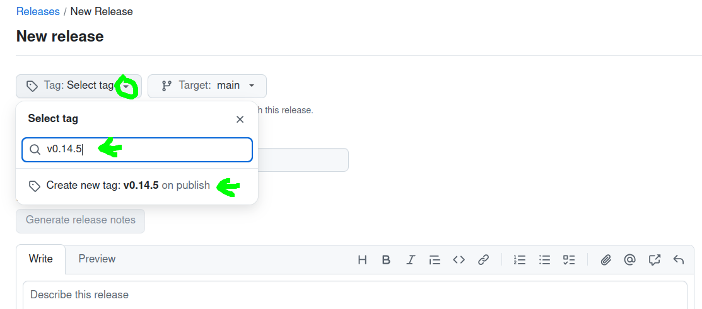

# Moss Release Instructions

## Release

1. Before running the release in CI it is worth checking that Moss is building fine locally. Run the corresponding command for your platform that you can read from the `package.json`. For linux:

```
yarn build:linux
```

2. If Moss builds fine locally, set the version number in `package.json` to the number you want to release Moss under. Then create a draft release on github with a tag `v[version number]`, e.g. `v0.14.5`:



Then click **"Save Draft"** to save the release as a draft. The CI workflow will expect a _draft_ release with the correct tag to upload the assets.

3. Now check out the `release` branch locally, merge `main` into `release` and run `git push`. This should start the release workflow on github.

4. Once the release workflow has succeeded, verify that all the expected assets have been added to the draft release and download one that's compatible with your operating system in order to do a manual test run. If it works to your satisfaction, you can publish the release, as pre-release or "latest", depending on what's appropriate.

## Update to a new version of Holochain

1. Go to https://github.com/holochain/holochain/releases and select the holochain release you want to use.

2. Update the holochain version in `moss.config.json`

3. Run `yarn update-hc-checksums` locally to automatically update the checksums in `holochain-checksums.json`.

4. Run `yarn fetch:binaries` locally to fetch the new binaries.

5. Follow the release process from the [Release](#release) section above.

## Update to a new version of group happ

Trigger `publish-happ` workflow. It will create the release draft automatically and use the version number from `package.json`.
Get the sha256 hash of the happ bundle and paste it into the `moss.config.json` file.

## Releasing NPM packages

For the CLI, make sure the updated holochain binaries have been fetched (`yarn build:cli ; cd cli & npm run postinstall`)

When updating all packages, publish in this order:

1. @theweave/api
1. @theweave/tool-library-client
1. @theweave/group-client
1. @theweave/elements
1. @theweave/moss-types
1. @theweave/utils
1. @theweave/cli
1. @theweave/wdocker

### Publishing only some of them

A package whose source has changed since its last release must be bumped and
republished before anything that depends on it, even when that package is not
what you set out to publish. In the monorepo yarn links every `@theweave/*`
dependency to the workspace, so an import resolves against source that may
never have been released; an installed copy resolves the same import against
the registry and dies at module load with "does not provide an export named
…". The version number alone does not tell you — a package can sit at one
version for weeks while its source moves.

`scripts/publish-staleness.mjs` checks this and runs as a `prepublishOnly`
hook for every package with sibling `@theweave/*` dependencies. To check
before you start:

```
node scripts/publish-staleness.mjs <package-dir>
```

Set `PUBLISH_ALLOW_STALE_DEPS=1` to publish anyway (for example when the
changed source is irrelevant to the dependent, or the registry is
unreachable).

The gate is static; it cannot prove the tarball works. For anything with a
bin, install the packed tarball from the real registry and run it before
announcing the release — `wdocker/README.md` has the procedure.
